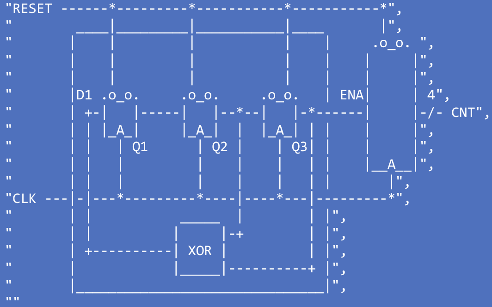
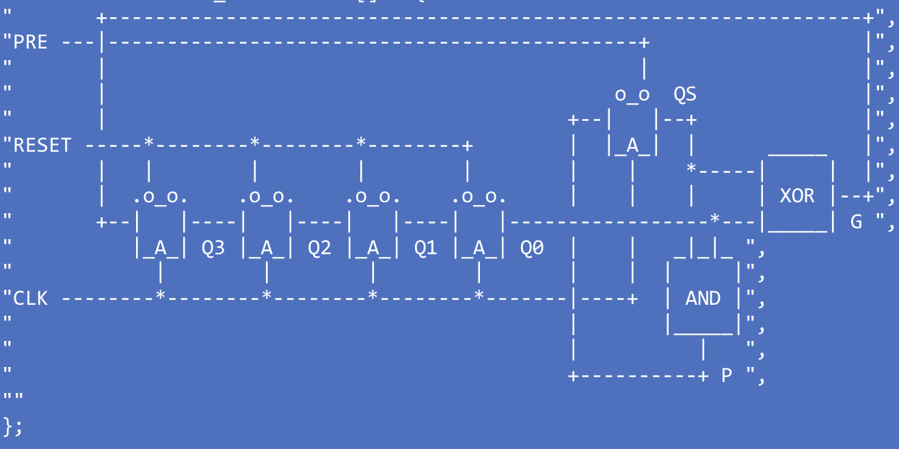
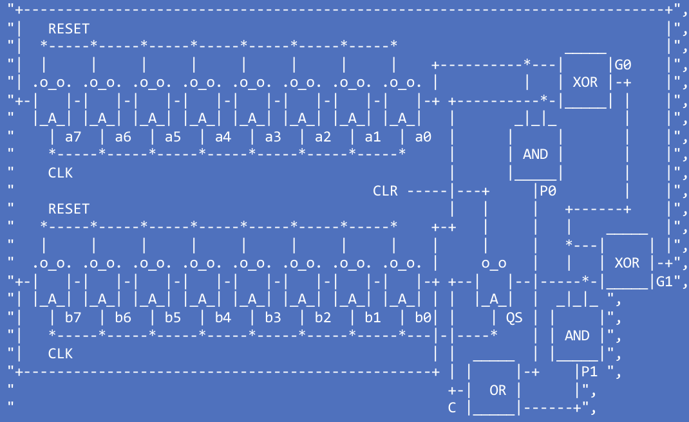
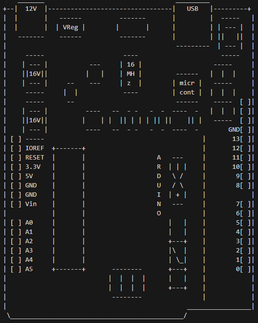

# Taller N° 02 — DISPRO
**Simulación de Circuitos Lógicos Secuenciales en Lenguaje C**

> Pontificia Universidad Javeriana · Departamento de Electrónica  
> Elaborado por: Sofía Margarita Vega, Juan Andrés Sanchéz y Andrés Felipe Trujillo

---

## Tabla de Contenidos

1. [Descripción General](#descripción-general)
2. [Estructura del Proyecto](#estructura-del-proyecto)
3. [Librerías Base](#librerías-base)
   - [Funciones Principales](#funciones-principales)
   - [Circuitos Secuenciales Digitales](#circuitos-secuenciales-digitales)
4. [Soluciones del Taller](#soluciones-del-taller)
   - [Punto 1 — Simulaciones con WaveDrom](#punto-1--simulaciones-con-wavedrom)
   - [Punto 2 — Simulación de Flip-Flop D en Arduino](#punto-2--simulación-de-flip-flop-d-en-arduino)
   - [Punto 3 — Flip-Flop Data en Arduino UNO](#punto-3--flip-flop-data-en-arduino-uno)
   - [Punto 4 — ASCII Art y EEPROM](#punto-4--ascii-art-y-eeprom)
   - [Punto 5 — Pendiente](#punto-5--pendiente)
5. [Compilación y Ejecución](#compilación-y-ejecución)

---

## Descripción General

Este taller busca consolidar el dominio de los **circuitos secuenciales digitales** a través de su simulación en **lenguaje C puro**, su implementación física en **Arduino UNO**, y la visualización de resultados mediante el formato de archivo **WaveDrom**. Los temas centrales son:

- Simulación de redes secuenciales digitales (LFSR, incrementador serial, sumador completo).
- Migración de código de PC a plataforma Arduino.
- Implementación de un Flip-Flop D con estímulos reales.
- Representación visual de componentes en **ASCII Art**.
- Almacenamiento de datos en **memoria EEPROM** de un microcontrolador.

---

## Estructura del Proyecto

```
Taller2-dispro/
│
├── Funciones Principales/          ← Librería base: compuertas, WaveDrom, conversión de bases
│   ├── Compuertas Logicas/
│   │   ├── LogicGates.h
│   │   ├── AND_gate.c
│   │   ├── OR_gate.c
│   │   ├── NOT_gate.c
│   │   └── XOR_gate.c
│   ├── WaveDrom Format/
│   │   ├── FormatoWaveDrom.h
│   │   └── FormatoWaveDrom.c
│   └── CambiosDeBase_Bus/
│       ├── CambioDeBases.h
│       └── Bus_Hexa.c
│
├── Circuitos Secuenciales Digitales/  ← Librería base: Flip-Flops, Clocks, Contadores
│   ├── Clocks/
│   │   ├── Clocks.h
│   │   └── Clocks.c
│   ├── Flip Flops/
│   │   ├── FlipFlops.h
│   │   └── FlipFlop_gate.c
│   └── Contadores Bits/
│       ├── Contadores_Bits.h
│       └── Contadores_4Bit.c
│
├── SolucionTaller/
│   ├── Punto1/                     ← Simulaciones en C (LFSR, Incrementador, Sumador)
│   ├── Punto3/                     ← Flip-Flop Data en Arduino UNO (.ino)
│   └── Punto4/                     ← ASCII Art en C y en ESP8266 con EEPROM (.ino)
│
└── CMakeLists.txt
```

---

## Librerías Base

Antes de explicar cada punto, es importante entender las dos carpetas que contienen las funciones reutilizables en todos los puntos.

### Funciones Principales

#### Compuertas Lógicas (`Compuertas Logicas/`)

Implementan las cuatro compuertas básicas en C puro:

| Función | Descripción |
|---|---|
| `AND_Gate(A, B)` | Retorna `A && B` |
| `OR_Gate(A, B)` | Retorna `A \|\| B` |
| `NOT_Gate(A)` | Retorna `!A` |
| `XOR_Gate(A, B)` | Retorna `(A && !B) \|\| (!A && B)` |

Estas funciones son la base de toda la lógica combinacional del proyecto.

#### Formato WaveDrom (`WaveDrom Format/`)

Genera salida en formato JSON compatible con [WaveDrom](https://wavedrom.com/) para visualizar diagramas de tiempo:

| Función | Descripción |
|---|---|
| `print_clock(name, max, is_last)` | Imprime un reloj en el JSON de WaveDrom |
| `print_wave(name, max, values[], is_last)` | Imprime una señal digital (0/1) por tiempos |
| `print_bus_hex(name, size, hexData[][], is_last)` | Imprime un bus en representación hexadecimal |
| `find_replace(input[], in_size, output[])` | Reduce la señal tomando una muestra por cada par de ciclos (submuestreo ×2 para WaveDrom) |
| `counter_to_decimal(cnt[], size, dec[][])` | Convierte un arreglo de conteo a cadenas decimales |

> **Nota:** La función `find_replace` es esencial porque la simulación trabaja con el doble de muestras (cada flanco alto y bajo del reloj) y WaveDrom necesita una muestra por ciclo completo.

#### Conversión de Bases (`CambiosDeBase_Bus/`)

| Función | Descripción |
|---|---|
| `bus4_to_hex(a3[], a2[], a1[], a0[], t, out[])` | Convierte 4 señales de 1 bit a string hexadecimal en el instante `t` |
| `bus8_to_hex(a7[]...a0[], t, out[])` | Convierte 8 señales de 1 bit a string hexadecimal en el instante `t` |
| `counter_to_hex2(cnt[], t, out[])` | Convierte el valor de un contador de 4 bits a hex de 2 caracteres |

---

### Circuitos Secuenciales Digitales

#### Clocks (`Clocks/`)

```c
int rising_edge_clock(int prev_clck, int clk);
```
Detecta el **flanco de subida** del reloj: retorna `1` únicamente cuando la muestra anterior era `0` y la actual es `1`.

#### Flip-Flop D (`Flip Flops/`)

```c
int def_flip_flop(int *state, int prev_clk, int clk,
                  int clear, int pre, int ena, int d, int *q);
```

Implementa un **Flip-Flop tipo D completo** con las siguientes entradas:

| Pin | Descripción |
|---|---|
| `clear` | Clear asíncrono activo en bajo — pone `Q = 0` inmediatamente |
| `pre` | Preset asíncrono activo en bajo — pone `Q = 1` inmediatamente |
| `ena` | Enable — si es `0`, el FF no captura datos |
| `d` | Dato de entrada |
| `clk / prev_clk` | Captura `D` solo en el **flanco de subida** del reloj |

La prioridad de operación es: **CLR > PRE > flanco de CLK con ENA activo**.

#### Contador de 4 Bits (`Contadores Bits/`)

```c
void counter_4Bits(int *Q, int clk_prev, int clk_now, int clr_n, int ena);
```

Contador binario de 4 bits (0–15) con:
- `clr_n = 0`: reinicia a cero de forma asíncrona.
- `ena = 1` y flanco de subida: incrementa `Q` en 1, con desbordamiento automático de vuelta a 0 (`& 0x0F`).

---

## Soluciones del Taller

### Punto 1 — Simulaciones con WaveDrom

**Enunciado:** Simular el comportamiento de tres circuitos, mostrar los resultados en formato WaveDrom e implementar las funciones usadas en la reposición del Parcial N° 1.

El ejecutable se llama `Run_Punto_Taller1` y llama en secuencia a las tres funciones de simulación:

---

#### a) Registro de Desplazamiento — `LFSR_03FF`

**Archivo:** `SolucionTaller/Punto1/Registro_de_Desplazamiento.c`

Simula un **LFSR de 3 Flip-Flops con realimentación XOR** (Linear Feedback Shift Register). El circuito corresponde al esquema del taller:



**Señales simuladas:** `clk`, `clr`, `pre`, `Q0`, `Q1`, `Q2`, `Q3`, `QS` (carry serial), `G` (XOR), `P` (AND).

**Condiciones iniciales:** `Q3=0, Q2=1, Q1=0`.  
**Duración:** 140 muestras (70 ciclos de reloj completos).

Cada ciclo, los datos se desplazan de Q1 → Q2 → Q3, mientras que `D = XOR(Q2, Q3)` y el resultado de `Q3` hace que el contador cuente o no.

---

#### b) Incrementador Serial de 4 Bits — `Incrementador_Serial_4Bits`

**Archivo:** `SolucionTaller/Punto1/Incrementador_Serial.c`

Simula un **incrementador serial de 4 bits** compuesto por un registro de desplazamiento de 4 etapas (`Q0`–`Q3`) con reset síncrono, un Flip-Flop de acarreo serial (`QS`) con preset, y dos señales combinacionales:



**Señales simuladas:** `clk`, `clr`, `pre`, `Q0`, `Q1`, `Q2`, `Q3`, `QS`, `G`, `P`.

**Condiciones iniciales:** `Q3=0, Q2=1, Q1=1, Q0=1, QS=1`.  
**Duración:** 140 muestras (70 ciclos).

En cada ciclo de reloj el dato se desplaza a través de la cadena `Q3 → Q2 → Q1 → Q1`, mientras que `QS` se retroalimenta con la señal `P` (acarreo). Las señales combinacionales son:

- `G = XOR(Q0, QS)` — bit de suma (salida serializada).  
- `P = AND(Q0, QS)` — acarreo al siguiente ciclo.

---

#### c) Sumador Completo de 8 Bits — `Sumador_Completo_8Bits`

**Archivo:** `SolucionTaller/Punto1/Sumador_Completo_8Bits.c`

Simula un **sumador completo serial de 8 bits** con dos registros de desplazamiento (uno para operando A y otro para B) y un Flip-Flop de acarreo (`QS`):



**Valores iniciales:**
- Operando A: `A7=1, A6=1, A5=1, A4=0, A3=0, A2=1, A1=1, A0=0` → `1110 0110` = `0xE6` (decimal 230)
- Operando B: `B7=0, B6=0, B5=1, B4=0, B3=1, B2=0, B1=0, B0=0` → `0010 1000` = `0x28` (decimal 40)
- Acarreo inicial: `QS = 0`

**Señales simuladas:** `clk`, `clr`, `pre`, `QS`, `C`, `G0`, `P0`, `G1`, `P1`, y los buses `A` y `B` en hexadecimal.  
**Duración:** 60 muestras (30 ciclos).

En cada ciclo, los bits seriales `a0` y `b0` se procesan a través de dos etapas combinacionales:

- `G0 = XOR(a0, b0)` — suma parcial de los bits de entrada.
- `P0 = AND(a0, b0)` — acarreo generado por la suma parcial.
- `G1 = XOR(QS, G0)` — bit de suma final (salida serializada).
- `P1 = AND(QS, G0)` — acarreo adicional por la entrada del Flip-Flop.
- `C  = OR(P0, P1)`  — acarreo total, que se retroalimenta a `QS` en el siguiente ciclo.

Los buses A y B se convierten de 8 líneas de 1 bit a su representación hexadecimal de 2 caracteres usando `bus8_to_hex`.

### Punto 2 — Simulación de Flip-Flop D en Arduino

**Enunciado:** Migrar la simulación del Flip-Flop D desde C en PC hacia Arduino, manteniendo la misma lógica de comportamiento y generando la salida en formato **WaveDrom JSON** por el monitor Serial.

**Archivo:** `SolucionTaller/Punto2/FlipFlopDataArduino.ino`

El sketch reproduce en Arduino la misma simulación por software del Flip-Flop D con reset (`CLR`), preset (`PRE`) y habilitación (`ENA`). En lugar de imprimir por `printf`, usa `Serial.print` y envía el JSON completo a 115200 bps.

#### Señales y parámetros

**Señales simuladas:** `clk`, `clr`, `pre`, `ena`, `D`, `Q`, `Qn`.  
**Duración:** 60 muestras (`N = 60`) → 30 ciclos completos (`R = N/2`).

| Señal | Descripción |
|-------|-------------|
| `clk` | Reloj periódico `1,0,1,0,...` |
| `clr` | Reset síncrono activo en `0` (prioridad máxima) |
| `pre` | Preset síncrono activo en `0` |
| `ena` | Habilitación: solo permite captura cuando está en `1` |
| `D`   | Dato de entrada al flip-flop |
| `Q`   | Salida del flip-flop |
| `Qn`  | Salida complementada |

#### Lógica de funcionamiento

En cada muestra se evalúan las condiciones en orden de prioridad:

1. **`CLR = 0`:** `Q = 0` (reset, prioridad máxima).
2. **`PRE = 0`:** `Q = 1` (preset).
3. **Flanco de subida de `CLK` con `ENA = 1`:** `Q` captura el valor de `D`.

#### Funciones auxiliares

| Función | Propósito |
|---------|-----------|
| `rising(prev, cur)` | Detecta transición `0 → 1` en el reloj |
| `down2(in, out)` | Submuestrea por factor 2 (conserva índices pares), reduciendo 60 → 30 muestras |
| `printClock(name, n, last)` | Imprime una señal de reloj periódica en JSON WaveDrom |
| `printWave(name, n, v, last)` | Imprime una señal binaria en JSON WaveDrom (`.` para sin cambio) |

#### Flujo de ejecución

```
setup()
  ├─ Serial.begin(115200)
  ├─ Part 1: Inicializar Q=0, q[0], qn[0]
  ├─ Part 2: Simular N=60 muestras aplicando lógica CLR/PRE/CLK
  ├─ Part 3: Submuestrear todas las señales con down2() → R=30 muestras
  └─ Part 4: Imprimir JSON WaveDrom por Serial
loop() → vacío (todo ocurre una sola vez en setup)
```


### Punto 3 — Flip-Flop Data en Arduino UNO

**Enunciado:** Conectar las 5 entradas (CLK, CLR, PRE, ENA, D) y 2 salidas (Q, Q') del Flip-Flop simulado a pines físicos del Arduino UNO, para que el microcontrolador se comporte externamente como un Flip-Flop Data real.

**Archivo:** `SolucionTaller/Punto3/FlipFlopDataArduino.ino`

#### Asignación de pines

| Pin Arduino | Señal | Dirección | Configuración |
|---|---|---|---|
| 3 | D (Data) | Entrada | `INPUT_PULLUP` |
| 4 | ENA (Enable) | Entrada | `INPUT_PULLUP` |
| 5 | PRE (Preset) | Entrada | `INPUT_PULLUP` |
| 6 | CLR (Clear) | Entrada | `INPUT_PULLUP` |
| 7 | CLK (Clock) | Entrada | `INPUT_PULLUP` |
| 8 | Q | Salida | `OUTPUT` |
| 9 | Q' (Qn) | Salida | `OUTPUT` |

> Los pines de entrada se configuran con `INPUT_PULLUP`, por lo que las señales activas en bajo (CLR, PRE) se activan conectando el pin a GND.

#### Lógica de funcionamiento

El sketch implementa fielmente la lógica del `def_flip_flop` de la librería base:

1. **CLR activo (`LOW`):** `Q = 0` inmediatamente (prioridad máxima).
2. **PRE activo (`LOW`):** `Q = 1` inmediatamente.
3. **Flanco de subida de CLK con ENA=`HIGH`:** `Q` captura el valor de `D`.

#### Debounce del reloj

Para evitar múltiples disparos por rebote mecánico de los interruptores, el CLK implementa un **debounce por software de 25 ms**:

```c
if ((now - lastClkChangeMs) >= DEBOUNCE_MS) {
    stableClk = rawClkPrev;
}
```
Solo cuando el pin CLK lleva 25 ms estable en su nuevo valor, se reconoce como un cambio definitivo.

#### Monitoreo por Serial

El sketch imprime a `Serial` (115200 bps) el estado completo en cada ciclo del `loop()`:
- Detección de cambios crudos en CLK.
- Activación de CLR o PRE.
- Captura de datos en flanco de subida.
- Notificación cuando `Q` cambia de valor (`"Q changed from X to Y"`).
- Estado final: `CLK(raw)`, `CLK(stable)`, `prevStable`, `CLR`, `PRE`, `ENA`, `D`, `Q`, `Qn`.

---

### Punto 4 — ASCII Art y EEPROM

**Enunciado:** Dibujar mediante símbolos ASCII la tarjeta Arduino UNO y el CI SN74HC595; luego hacer que el Arduino UNO se dibuje a sí mismo en consola a partir del código ASCII guardado en la memoria EEPROM.

Este punto se divide en tres sub-tareas, cuyo ejecutable en C es `Run_Punto_Taller3`.

---

#### a) Diagrama ASCII del Arduino UNO en C

**Archivo:** `SolucionTaller/Punto4/ard1ACSII.c`

Imprime en consola un dibujo ASCII detallado de la tarjeta Arduino UNO, incluyendo:
- Conector de alimentación (12V, VReg, 16V).
- Módulo USB y conector de programación.
- Microcontrolador ATmega328.
- Cristal oscilador y botón de reset.
- Pines analógicos (A0–A5) y digitales (0–13).
- Conectores IOREF, 3.3V, 5V, GND, Vin.

El dibujo se almacena como un arreglo de cadenas `const char*` y se imprime con un simple `puts()` en bucle.



---


#### b) Diagrama ASCII del CI SN74HC595 en C

**Archivo:** `SolucionTaller/Punto4/SN74HC595n.c`

Imprime el pinout completo del **SN74HC595** (registro de desplazamiento de 8 bits, encapsulado DIP-16):

```
               +----( )----+
    QB  [ 1] --|           |-- [16]  VCC
    QC  [ 2] --|           |-- [15]  QA
    QD  [ 3] --|           |-- [14]  ~SER
    QE  [ 4] --|           |-- [13]  ~OE
    QF  [ 5] --|           |-- [12]  RCLK
    QG  [ 6] --|           |-- [11]  ~SRCLK
    QH  [ 7] --|           |-- [10]  ~SRCLR
   GND  [ 8] --|           |-- [ 9]  QH'
               +-----------+
```

Muestra todos los pines con su número y nombre según el manual de referencia de Texas Instruments.

---

#### c) Arduino se dibuja a sí mismo desde la EEPROM — ESP8266

**Archivo:** `SolucionTaller/Punto4/CodigoArduinoASCII.ino`

Sketch para **ESP8266** que almacena y recupera datos desde la EEPROM emulada en flash (1 KB). Al ejecutarse, imprime por Serial el dibujo ASCII de un Arduino UNO leyendo los datos desde esa EEPROM.

**¿Por qué no guardar el texto directamente?**

El dibujo ASCII completo ocupa varios KB, más de lo que caben en 1024 bytes de EEPROM. La solución es guardar solo **números pequeños (IDs)** que apuntan a cada línea del dibujo:

- El arreglo `LINEAS[]` (con las 34 líneas del dibujo) vive en la memoria del programa como `const char*`.
- En EEPROM solo se guardan los índices `1, 2, 3, ..., 34` seguidos de un `0` como marcador de fin — apenas 35 bytes en total.
- Al leer, el sketch recorre esos IDs y por cada uno imprime `LINEAS[id - 1]` por Serial.

**Firma de validación (`LN10`):**

Para no reescribir la EEPROM en cada reinicio, los primeros 4 bytes guardan la firma `'L','N','1','0'`. Si ya está, se salta la escritura:

```
DIR 0: 'L'  DIR 1: 'N'  DIR 2: '1'  DIR 3: '0'   ← Firma (4 bytes)
DIR 4: 1    DIR 5: 2    DIR 6: 3    ...  DIR 37: 0  ← IDs de líneas
```

**Flujo de ejecución:**

```
setup()
  ├─ Serial.begin(115200)
  ├─ EEPROM.begin(1024)
  ├─ ¿Tiene firma 'LN10'?
  │    ├─ NO → escribir firma → guardar IDs → EEPROM.commit()
  │    │        └─ imprime bytes usados y bytes libres por Serial
  │    └─ SÍ → saltar escritura
  └─ imprimir_ascii_desde_eeprom()
       └─ Lee ID por ID → imprime LINEAS[id-1] por Serial hasta encontrar 0
loop() → vacío (todo ocurre una sola vez en setup)
```

---

### Punto 5 — Pendiente

*La solución de este punto está en desarrollo.*

---

## Compilación y Ejecución

El proyecto usa **CMake** (versión ≥ 3.20) para compilar los puntos en C.

```bash
# Desde la raíz del proyecto
mkdir build
cd build
cmake ..
cmake --build .
```

Esto genera dos ejecutables:

| Ejecutable | Descripción |
|---|---|
| `Run_Punto_Taller1` | Corre las simulaciones del Punto 1 (LFSR, Incrementador, Sumador) |
| `Run_Punto_Taller3` | Imprime en consola el ASCII del Arduino UNO y del SN74HC595 |

Para visualizar los diagramas de tiempo del Punto 1, copie la salida JSON generada por `Run_Punto_Taller1` y péguela en [https://wavedrom.com/editor.html](https://wavedrom.com/editor.html).

Para los sketches de Arduino (Punto 3 y Punto 4), use el **Arduino IDE** o **PlatformIO**, seleccionando la placa correspondiente:
- Punto 3: **Arduino UNO**
- Punto 4 (EEPROM): **ESP8266** (por ejemplo, NodeMCU 1.0)
